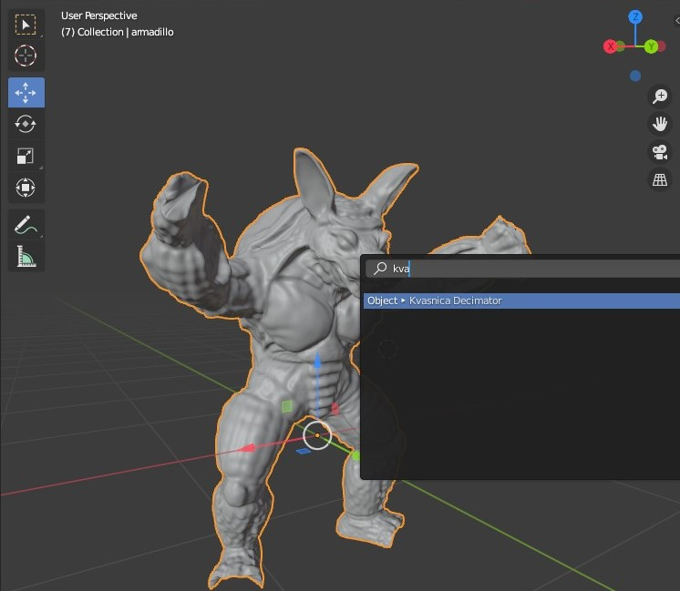
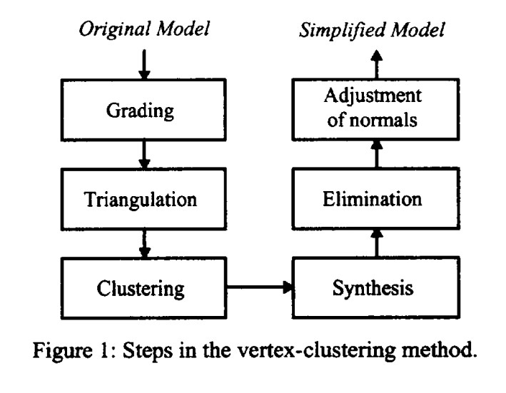
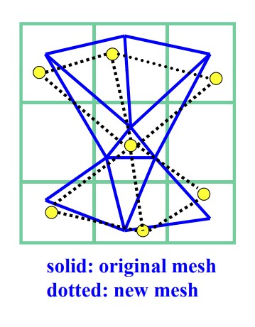
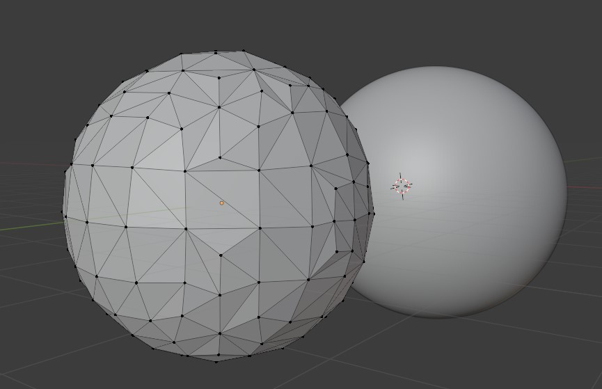
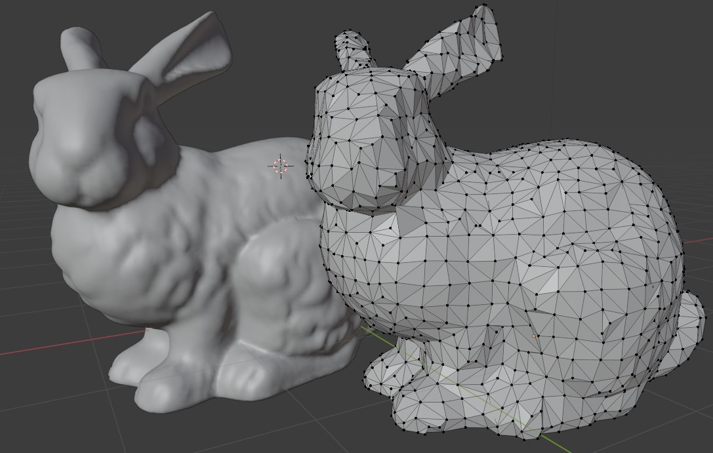
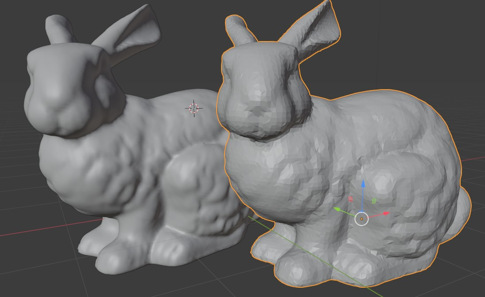
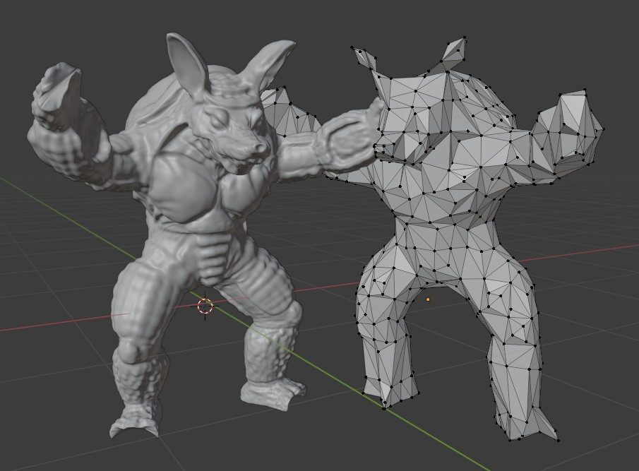
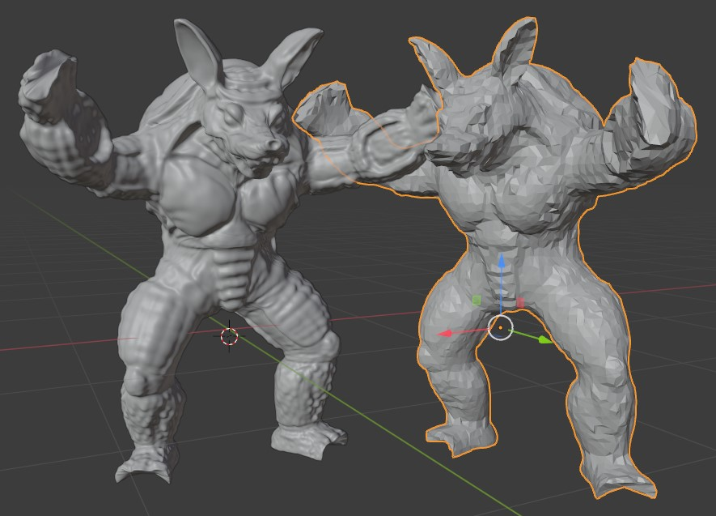
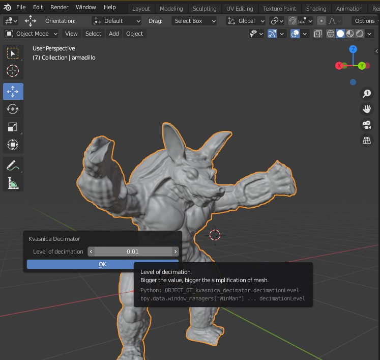

# Kvasnica Vertex Clustering Decimation Blender plug-in

## Installation:

**WARNING:** Plugin was written in Blender version 2.90.1, it is required to have at least version 2.80, older versions are incompatible due to changes in Blender API.


### Python script [Decimation.py](source/Decimation.py)
- Open the script in blender script editor or copy this source code into its Text Editor. Run the script and the plugin will register itself. To run, just select the object to decimate in object mode and search for "Kvasnica Decimator".



# Decimation process

## Assignment:
- Create a Blender plug-in that sophisticatedly reduces mesh complexity (reducing the number of triangles)
- The plugin needs to be more sophisticated than the method offered by blender itself.
- Parametrically decimate the mesh object.

### Vertex Clustering Method
- The bounding box of the decimated object is decomposed into cells. Each cell can hold multiple vertices at once, from which a new representative vertex is calculated. If some vertices in a cell have been connected to vertices of other cells, then there will be an edge between the representative vertices of those neighboring cells as well.

- The algorithm has the advantage of having linear computational complexity over the set of `n` vertices `O(n)`, but the resulting grid quickly loses detail at higher levels of decimation and may not be sufficient.

### Algorithm:

1. **Vertex grading** - The weight of each vertex is calculated, which depends on two factors.
    - probability that the vertex lies in the outline of the object from any view direction
    - the size of the faces that are bound by this vertex

2. **Mesh triangulation** - all polygons are converted to triangles. (Each face has only three vertices)

3. **Clustering** - Create cells (blocks inside the bounding box of the object) according to the specified size and assign the vertices that are contained in them.



4. **Synthesis** - Calculate a representative vertex for each cell that contains at least one vertex of the original object. This vertex will replace all those that fell into that one cell in the new simplified mesh. Calculated as a weighted average of the vertices according to the weight of each vertex in the cell.

5. **Elimination** - Eliminates duplicate triangles, vertices and edges.

6. **Adjustment of normals** - the normals of the resulting polygons should not point inside the object.

### Notes
- The plug-in creates a new object so that the original object remains unchanged. Triangulation is performed over a copy of the decimated object.

- When the plugin completes, the original object is made invisible and a new simplified object is added in its place.

- Improvements to the valuation of vertices have been implemented. Instead of `1/theta`, `cos(theta/2)` was used to better estimate the vertex weight. `theta` - maximum angle between two edges of a vertex

- Normals were adjusted by adding new faces to the new mesh in the same order in which they were obtained from the structure.

```python

# Get list of cell indices of the face (max 3 items, mesh is triangulated)
newFaceIndicies = [ v.index for v in face.verts ]
# get list of new vertices by searching
newFace = [ simpleVertDict[i] for i in newFaceIndicies ]
# add new face to final mesh
self.NewMesh.faces.new(newFace)
                
```

- Zdroje: [mtu.edu](https://pages.mtu.edu/~shene/COURSES/cs3621/SLIDES/Simplification.pdf), [comp.nus.edu.sg](https://www.comp.nus.edu.sg/~tants/Paper/simplify.pdf)


# Examples

## UV Sphere
- ~65K vertices
### decimation level 1.5
- 185 vertices
- 366 triangles


## Stanford Bunny
- 34817 vertices
- 69630 triangles

### decimation level 0.5
- 1456 vertices
- 2944 triangles


### decimation level 0.15
- 13894 vertices
- 27841 triangles


## Armadillo
- 106289 vertices
- 212574 triangles

### decimation level 0.73
- 635 vertices
- 1327 triangles


### decimation level 0.2
- 8117 vertices
- 16618 triangles


# Plug-in

## UI


- Level of decimation - determines how big the cells should be. The higher the number, the greater the decimation. For example, specifying 1.0 will create a cell where each cell takes up 10% of the width on each axis of the bounding box of the object.

```python

# xyz dimensions of one cell
unit = level * self.Dimension

```

- `level` - float z uživatelského vstupu level of decimation
- `self.Dimenstion` - vektor držící rozměry bounding boxu decimovaného objektu
- `unit` - rozměry jedné buňky (cell)

## Třídy

### Cell
- holds its identifier
- contains a list of vertices that are located within it.
```python
class Cell:
    def __init__(self, id):
        # cell identifier
        self.Index = id
        # vertices in this cell. VertexInfoContainer references
        self.Verts = []
```
### VertexInfoContainer
- holds the reference for vertex in bmesh vert
- calculates its weight during construction

```python
class VertexInfoContainer:
    def __init__(self, v):
        # BMesh.Vert reference
        self.Vertex = v
        # Vertex weight evaluation function
        self.Grade = math.cos(self.GetMaxAngle()/2)
```

- maximum angle calculation:

```python
def GetMaxAngle(self):
    res = sys.float_info.min
    edges = self.Vertex.link_edges
    
    # Foreach combination of twoedges. Combinations are unique.means no (3,2) and (2,3)
    for edge in combinations(edges,2):
        # edge vector
        ev1 = edge[0].verts[0].co -edge[0].verts[1].co
        ev2 = edge[1].verts[0].co -edge[1].verts[1].co
        
        #angle between edge vectors in radians
        tmp = abs(ev1.angle(ev2))
        
        if tmp > res:
            res = tmp
    
    return res
```

### DecimatingObj
- class that needs a blender object for construction
```python
class DecimatingObj:
    # setups the decimating object
    def __init__(self, object):
        # Makes a copy of a original object
        self.Object = object.copy()
        self.Object.data = object.data.copy()
        self.Object.animation_data_clear()
        self.Object.name = "_" + object.name
        self.Dimension = object.dimensions
            
        bbLocal = [Vector(v) for v in object.bound_box]
        worldMat = object.matrix_world        
    
        # World coordinates of objects bounding box
        # operant @ is a matrix and vector multiplication operation. For some reason
        # Asterisk * is unsupported in blender 2.80 >= version and @ is unsupported in version < 2.80
        self.BoundBox = [worldMat @ v for v in bbLocal]
        
        minX = min([v.x for v in self.BoundBox])
        minY = min([v.y for v in self.BoundBox])
        minZ = min([v.z for v in self.BoundBox])
        self.Min = Vector((minX, minY, minZ))
        
        # Creates bmesh instance of the original objects mesh data
        self.Mesh = bmesh.new()
        self.NewMesh = bmesh.new()
        self.Mesh.from_mesh(self.Object.data)
        
        # Triangulate the mesh
        bmesh.ops.triangulate(self.Mesh, faces=self.Mesh.faces[:], quad_method='BEAUTY', ngon_method='BEAUTY')
        
        # Dictionary of decimated vertices ((key = cellIndex, value = new BMeshVert))
        self.simpleVertDict = dict()
        
        # Dictionary of cells (( key = tuple(x, y, z), value= Cell Class ))
        self.cellDict = dict()
```
- a copy of the input object is created from which the mesh is obtained.
- creates a new mesh for the output object
- initializes two empty dictionaries.
    - dictionary for cells that use a tuple with x, y, z coordinates as key
    - a dictionary of representants that have a key as the index of the cell they represent
- bmesh instances are released on destruction in the `__exit__` method

### KvasnicaDecimator
- registered class body
```python
class KvasnicaDecimator(bpy.types.Operator):
    bl_idname = "object.kvasnica_decimator"
    bl_label = "Kvasnica Decimator"
    
    decimationLevel : FloatProperty(
        name = "Level of decimation",
        description = "Bigger the value, bigger the simplification of mesh",
        default = 0.01,
        min = 0.01,
        max = 2.0
    )
    
    # Invokes UI dialog of the plugin. After pressing OK, procedure will be executed.
    def invoke(self, context, event):
        return context.window_manager.invoke_props_dialog(self)
    
    
    def execute(self, context):
        original = bpy.context.active_object

        obj = DecimatingObj(original)
        
        #hides original object in viewport
        original.hide_set(True)
        
        obj.Decimate(self.decimationLevel/10)
        
        obj.LinkToScene()
        
        bpy.ops.object.select_all(action='DESELECT')
        obj.Object.select_set(True)
        
        return {'FINISHED'}
```

